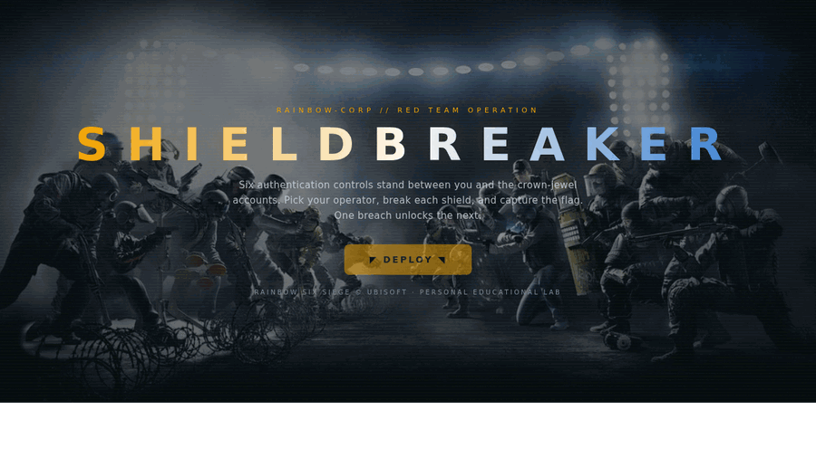

# 6️⃣ OPERATION SHIELDBREAKER

[](LICENSE)



A single-site, layered authentication CTF for practising the **OWASP WSTG Authentication**
tests. One website, six operations. **Missions unlock one at a time** — clear the current
breach and the next operation appears at Command; everything beyond it stays classified.

> Unofficial fan project, not affiliated with Ubisoft. Code is MIT-licensed; Rainbow Six Siege
> assets used for theming are not — see [Legal / Disclaimer](#️-legal--disclaimer) below.

Themed on Rainbow Six Siege, with **faction-accurate rosters** — you play a real R6
**attacker** breaching a real R6 **defender** that represents the app's security control.

| Side | Operators |
|------|-----------|
| **Attackers** (you play) | IQ · Sledge · Dokkaebi · Thermite · Blitz · Nomad |
| **Defenders** (the controls) | Mute · Castle · Clash · Oryx · Aruni · Kaid |

---

## 📖 Which doc do you want?

Each operation has its own briefing + debrief, grouped by campaign folder:

| I want to... | Read |
|---|---|
| **Play it** as a real blackbox challenge | [`shieldbreaker/README.md`](shieldbreaker/README.md) — mission index, rules of engagement, links to every operation's `CHALLENGER.md`. **No spoilers.** |
| **Check my work**, or understand *why* it worked after solving | Each operation's own `DEBRIEF.md` (e.g. [`shieldbreaker/op1/DEBRIEF.md`](shieldbreaker/op1/DEBRIEF.md)) — the lesson in plain language, code walkthrough, self-check, full answer key. Spoilers. |
| Understand how it's **built** | keep reading below |

---

## 🎯 Campaign

| # | Operation | Matchup | WSTG | Attack |
|---|-----------|---------|------|--------|
| 01 | Callsign Recon | **IQ** ⚔ **Mute** | IDNT-04 | Username enumeration |
| 02 | Breach & Clear | **Sledge** ⚔ **Castle** | ATHN-07 | Dictionary attack |
| 03 | Hard Breach | **Dokkaebi** ⚔ **Clash** | ATHN-03 | CAPTCHA bypass |
| 04 | Lockdown Failure | **Thermite** ⚔ **Oryx** | ATHN-03 | Lockout bypass |
| 05 | Ghost in the Panel | **Blitz** ⚔ **Aruni** | ATHN-04 | Auth-schema bypass |
| 06 | Back Door | **Nomad** ⚔ **Kaid** | ATHN-08 | Alternative-channel auth |

> **All six operations ship.** The campaign is complete — each reveals in the UI (and has its
> own `CHALLENGER.md` / `DEBRIEF.md` under [`shieldbreaker/`](shieldbreaker/)) the moment the
> previous one is cleared.

---

## 🚀 Run

```bash
docker compose up --build      # then open http://localhost:8000
```
or without Docker:
```bash
pip install -r requirements.txt && python3 app.py
```

The landing page (`/`) is **Command** — the operator-select and mission board. Progress is
tracked in your browser session; **Reset Progress** clears it.

---

## 🗂️ Repo layout

```
app.py                 # all mission routes + Command/hub logic (session-based unlock)
templates/              base.html (Tailwind theme) + hub.html + op{1..6}_*.html
static/vendor/          tailwind.js (vendored — offline, no CDN needed)
static/img/ops/         real operator icons (see Assets below)
static/img/             victory clips (per-op) — victory-op<N>.gif or .webp
static/img/intro-wall.jpg  Command's intro splash wallpaper
wordlists/               recon wordlists handed to the player (no answers)
shieldbreaker/           campaign docs, one folder per operation:
  README.md                mission index + rules of engagement
  op1/ .. op6/              each has CHALLENGER.md (no spoilers), DEBRIEF.md (spoilers),
                            and solver.py (reference/instructor solver)
```

The Flask app itself (`app.py`, `templates/`) stays a single unified site regardless of how
many campaigns exist — only the docs/solvers are split per-operation. Adding an operation =
add its route(s)/logic to `app.py`, templates, a wordlist if it needs one, a mission entry in
`MISSIONS` (set `built: True`), and a new `campaignname/opN/` folder with its three files.

---

## 🎨 Design & assets

The UI is built on **Tailwind CSS**, vendored locally at `static/vendor/tailwind.js` (no CDN /
internet needed at runtime). The Rainbow Six palette + cinematic keyframes live in the
`tailwind.config` block at the top of `templates/base.html` — change the theme in one place.

- **Operator icons** — official-style icons from the community `r6operators` package.
  Re-fetch any time: `bash assets/fetch_assets.sh`.
- **Victory clips** — each cleared operation's console plays a themed breach overlay pulling
  from `static/img/victory-op<N>.{gif,webp}` (each op's console template names its own exact
  file — check the `` line in `templates/op<N>_console.html` if you want to swap
  one). Every victory `` has an `onerror` fallback to the operator's icon with a CSS
  slam animation, so a missing or renamed file never breaks the page — it just looks a little
  plainer.
- **Intro splash** — Command's landing screen (`templates/hub.html`) shows a full-bleed
  wallpaper (`static/img/intro-wall.jpg`) once per browser session before revealing the mission
  board; falls back gracefully (just no image) if that file is absent.

---

## ⚖️ Legal / Disclaimer

**This is an unofficial, non-commercial, fan-made educational project. It is not affiliated
with, endorsed by, or sponsored by Ubisoft Entertainment.**

- **Code & original writing** (`app.py`, template markup/logic, every `solver.py`, every
  `CHALLENGER.md`/`DEBRIEF.md`, this README, and everything else authored for this repo) is ©
  the repo owner and released under the [MIT License](LICENSE) — see that file for the full text.
- **Rainbow Six Siege assets** used for theming — operator names, operator icon artwork
  (`static/img/ops/`), the intro wallpaper (`static/img/intro-wall.jpg`), and the victory video
  clips (`static/img/victory-op*.*`, `static/img/lib/`) — are **not** covered by
  that license. They remain the property of **Ubisoft Entertainment** and/or their respective
  rights holders, used here solely for non-commercial educational/thematic purposes. No
  ownership over these assets is claimed, and no challenge is intended to their rights. If you
  are a rights holder and want something removed, open an issue and it'll come down.
- Rainbow Six Siege and all associated names, characters, and logos are trademarks of Ubisoft
  Entertainment.

If you fork this project for your own public use, consider replacing the third-party assets
listed above with originals — the codebase is built to support that (every victory image has a
built-in fallback to a CSS-animated placeholder if its file is missing or swapped out).
